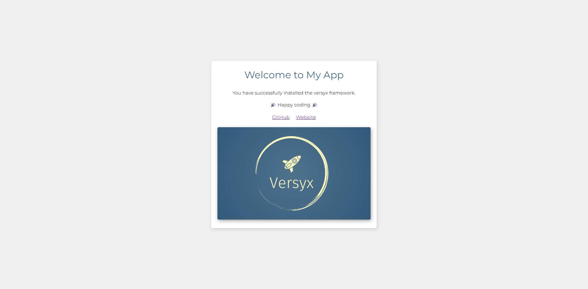

# Versyx Starter Project

## About Versyx



This is the starter skeleton for projects using [Versyx](https://github.com/versyxdigital/framework).

Versyx is a lightweight PHP framework suitable for developing web applications. It is a small-yet-powerful framework that comes with many features to aid in development, such as:

- A powerful dependency injection container.
- Built-in routing with support for API and web routes.
- Session management with support for multiple drivers.
- Database management with support for multiple drivers.
- PSR-7 compliant request handling and view rendering.
- PSR-3 compliant application logging.

## Getting Started

### Requirements

- Composer
- PHP
- Docker (optional)


### Installing Versyx

You may create a new Versyx project via Composer's `create-project` command:

```sh
composer create-project versyx/versyx my-app
```

### Initial Configuration

Once the project has been created, you're ready to begin configuring your application.

Copy the `.env.example` file that is provided to `.env` and configure your application's environment variables, for example:

```sh
APP_NAME="My App"

APP_ENV=development # or "production"
APP_DEBUG=true
APP_CACHE=true

SESSION_DRIVER=file # or "database", "memory"

DB_DRIVER=pdo_mysql
DB_HOST=versyx-db # if using docker, this is the name of the container
DB_USERNAME=root
DB_PASSWORD=password
DB_DATABASE=versyx
MYSQL_ROOT_PASSWORD=password
```

Now you are ready!

### Docker

Versyx comes with a pre-configured docker environment for easy development.

To start the container:

```sh
docker-compose up -d
```

Once the container is running, head over to http://localhost to view your application, don't forget to add the port number if you have changed the value of `HTTP_LOCAL_PORT` to something other than the default port 80.

## How it works

Versyx follows the MVC pattern and uses a service container with powerful dependency injection in order to make development a breeze.

## The Service Container

The service container lies at the heart of Versyx, it is responsible for managing class dependencies and making making them available for dependency injection. Dependency injection allows us to inject dependencies into classes via the constructor, or in some cases, "setter" methods.

## Service Providers

Service Providers are responsible for registering dependencies or "services" into the service container. What we mean by "registering" is creating a new instance of a service, and then binding that instance to the container using either a string identifer, a fully-qualified class name (FQCN), or an interface.

For example, here is a simple demo custom class responsible for making API requests from an application that is built using the Versyx framework.

```php
namespace MyApp;

class ApiClient 
{
    protected array $config = [];

    public function __construct(array $config) {
        $this->config = $config;
    }

    public function get(string $endpoint) {
        $response = $request->get($endpoint);
        return $response->getBody();
    }
}
```

To register this class as a service in the container, a service provider would be created.

```php
namespace MyApp\Providers;

use Versyx\Provider;
use Versyx\Service\ServiceProviderInterface;

class ApiClientServiceProvider implements ServiceProviderInterface
{
    public function __construct(Container $container) {
        $config = [
            'base_uri' => env('API_BASE_URI')
             ...
        ];

        // Bind to container using FQCN
        $container[ApiClient::class] = new ApiClient($config);

        return $container;
    }
}
```

This service provider would be called in the application's [bootstrap script](https://github.com/versyxdigital/versyx/blob/main/bootstrap.php) (please note the bootstrap script resides in the web starter project, not this framework core code repository).

```php
/*----------------------------------------
 | Create service container               |
 ----------------------------------------*/
$app = new Versyx\Service\Container();

/*----------------------------------------
 | Register service providers             |
 ----------------------------------------*/
$app->register(new Versyx\Providers\LogServiceProvider());
$app->register(new Versyx\Providers\RouteServiceProvider());
$app->register(new Versyx\Providers\ViewServiceProvider());

$app->register(new MyApp\Providers\ApiClientServiceProvider());
```

After the service is registered, it is available for dependency injection. For example, to use it in an application's `HomeController`.

```php
namespace MyApp\Http\Controllers;

use Versyx\Http\AbstractController;
use MyApp\ApiClient;

class HomeController extends AbstractController
{
    // ApiClient instance is injected into route method handler
    public function index(ApiClient $client) {
        $exchangeRates = $client->get('currency/gbp/exchange');
        
        return $this->view('home', [
            'exchangeRates' => $exchangeRates
        ]);
    }
}
```

### Service Locator vs Dependency Injection

Service locator and dependency injection are both design patterns used for managing dependencies and both are supported by Versyx.

#### Dependency Injection

In the example above, we used dependency injection, the example `ApiClient` object was retrieved through the dependent `HomeController`'s `index()` method, the dependency was *injected* into the class method.

```php
public function index(ApiClient $client) {
    ...
```

#### Service Locator

Service locator is a pattern where a "central registry", known as the service locator, is used to retrieve services and dependencies. A service locator provides a global point of access to a service.

Services still need to be registered to the container, however, the way they are retrieved is different. Versyx provides a global `app()` helper function to retrieve services using the service locator pattern.

Here is the same `HomeController` example, using the service locator pattern.

```php
namespace MyApp\Http\Controllers;

use Versyx\Http\AbstractController;
use MyApp\ApiClient;

class HomeController extends AbstractController
{
    public function index() {
        $exchangeRates = app(ApiClient::class)->get('currency/gbp/exchange');
        
        return $this->view('home', [
            'exchangeRates' => $exchangeRates
        ]);
    }
}
```

#### Which should you use?

Both patterns have their place in software development, but dependency injection is generally preferred due to its advantages in decoupling, testability, and clarity. Service locator can be useful in scenarios where centralising the management of dependencies is necessary, but it should be used with caution due to its tendency to obscure dependencies and increase coupling.

## Routing

For routing requests, under the hood, Versyx uses Nikita Popov's [FastRoute](#https://github.com/nikic/FastRoute). Application routes are defined in the "routes" directory:

- `routes/web.php`: For web routes.
- `routes/api.php`: For API routes.

Routes are structured in the following format:

```php
/*----------------------------------------
 | Configure application web routes       |
 ----------------------------------------*/

return [
    '/' => [
        ['GET', '/', [App\Http\Controllers\HomeController::class, 'index']]
    ],

    '/products' => [
        ['GET', '/', [App\Http\Controllers\ProductController::class, 'index']]
        ['GET', '/{id}', [App\Http\Controllers\ProductController::class, 'show']]
    ],
];
```

Where the outer-array keys contains the path prefix and the values are arrays consisting of:

- Request method (e.g. `GET`, `PUT`, `POST`, `DELETE`).
- Route handler (e.g. `App\Http\Controllers\ProductController::class`).
- Route handler method (e.g. `index` or `show`).

### Route handling

Requests to routes are handled via **controllers**, for a simple example, consider this `ProductController`, designed to service the product routes:

```php
namespace MyApp\Http\Controllers;

use Doctrine\ORM\EntityManager;
use Versyx\Http\AbstractController;
use MyApp\Entities\Product;

class ProductController extends AbstractController
{
    /**
     * List products - /products
     */
    public function index(EntityManager $em) {
        $products = $em->getRepository(Product::class)
            ->findAll();
                
        return $this->view('products/index', compact('products'));
    }

    /**
     * Show product - products/{id}
     */
    public function show(int $id, EntityManager $em) {
        $product = $em->getRepository(Product::class)
            ->find($id);
                
        return $this->view('products/show', compact('product'));
    }
}
```

Here is an explanation of how it works:

- The controller's `index` method handles requests to the `/products` route, Doctrine's `EntityManager` is injected into the method to provide access to the database and obtain products to return with the view which is located at `resources/views/products/index.twig`.

- The controller's `show` method handles requests to the `/products/{id}` route, it accepts a **path parameter (ID)** and also injects the `EntityManager` for access to the database. The product is queried by its ID and returned with the view which is located at `resources/views/products/show.twig`.

> NOTE: The order of injected arguments in route handler methods don't matter, this is because Versyx leverages reflection to inspect the method paramters and resolve each dependency individually